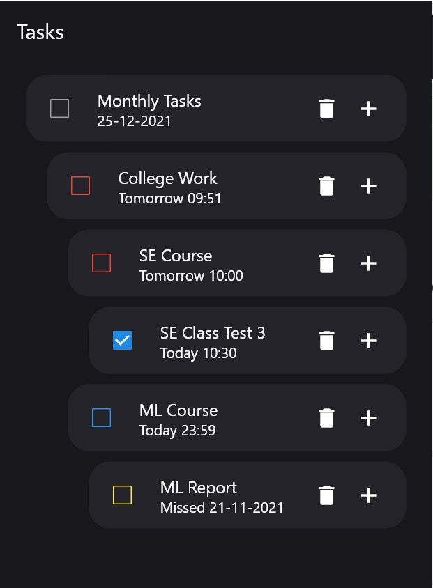

# Tack

Tack is a hierarchial task manager. Heirarchial task 
management allows very long tasks to be broken down into smaller and smaller 
subtasks and hence is also suitable for long-term planning unlike other task 
managers. It is based on Multitree data structure. This allows two or more 
tasks to share a single subtask.

It tries to solve the problems with existing task managers:

- Some task managers are too simple to be considered productive. Even important 
features like subtasks and notifications are missing in these projects.
- Some task managers are too complicated to be considered productive. They 
offer too many extra features which distract the user from actually completing 
tasks. Features like adding locations and images to tasks shouldn't be present 
in a todo list.
- Most task managers are not designed in a way that enables users to add tasks 
as quickly as possible. For trivial tasks such as adding a task with just a 
title and without any additional data, it takes 2-3 button presses.
- In task managers with sync feature, tasks are stored unencrypted on a server.
- Task managers offering both cross-platform graphical and command-line 
applications are non-existant.

Tack attempts to solve these problems.

- It strikes the right balance between being simplistic and featureful. Only 
features that improve the productivity of the users will be present. Advanced 
features like sync won't be visible to new users unless they go out of their 
way to enable them.
- It is designed to allow quick planning from the user. Adding a task should be 
as simple as pressing a key, entering its title, then pressing enter. Such 
speed can be achieved though the use of vi-like bindings.
- Syncing of tasks should be end-to-end encrypted as tasks constitute of 
personal information.
- It should be should be supported on all major operating systems, viz. 
Android, Windows, Linux and OSX.

## Project Design:

### Data structure for tasks:

Tack's design is based on two premises:

Breaking a problem up into smaller, more manageable parts is generally a good approach to problem-solving.
Tracking progress across time improves focus by removing the mental overhead associated with many parallel tasks spanning multiple days.
Tasks may be represented as tree nodes, enabling their subdivision. By introducing date nodes into the structure, and viewing the trees in the context of a larger multitree, we can distribute work on root tasks across multiple days by creating cross links to their descendants.

A multitree is a class of directed acyclic graphs (DAGs) with the unusual property that they have large easily identifiable substructures that are trees. These subtrees have a natural semantic interpretation providing alternate hierarchical contexts for information, as well as providing a natural model for hierarchical reuse.

Unlike tree nodes, nodes of a multitree can have multiple parents, allowing us to create cross links between different task trees.

Multitrees are digraphs, so the nodes are connected to one another by directed links. For our purposes, the direction flows from parent tasks to their subtasks. From any node we can induce a valid tree by following the outgoing links:


### Database:

Tack implements its own database using the filesystem. A filesystem based storage has many advantages:

- It is easy to understand and maintain.
- It reduces the number of dependencies on external libraries.
- Git sync can be easily implemented if the tasks are stored in files.
- File-based encryption works well with git sync.

#### Filesystem storage specification:

Task data is stored in the filesystem in the following format: (All directories referenced below are relative to data directory)

- Inside `.`, There are folder title numbered from 0 to n - 1, where n is the total number of tasks.
- Inside `i`, text files with following names are present:
  * `title` contains the title of ith task.
  * `status` contains the status (Pending or Finished) of ith task
  * `startdate` contains the start date of ith task.
  * `duedate` contains the due date of ith task.
  * `priority` contatins the priority (None, Low, Medium or High) of ith task
  * `j` where j is a positive integer. This means that the task `i` has `j` as a child task. The contents of `j` do not matter.

### Tree View

Tack uses a unique approach to show tasks to the user. It makes use of all available space on the screen.

- The first task on the screen is the 'root' task. All the other tasks on the screen are direct or indirect children of this task.
- In order to view the subtasks of any other task, the user needs to make it the root task, by tapping on the specific task.
- In order to view the parent task of the current root task, the user has to swipe right. This changes the root to the parent task of the current root task.
- Instead of providing a function to expand and collapse subtasks, the user has to tap a task to view its subtasks.
- Tasks cannot be scrolled through. Tack is specifically designed so that the user cannot get lost if they have a lot of tasks.

## Build Instructions:

To build the project, ensure that flutter (beta channel) is installed in the system and is in `PATH`. Then run the following commands.

```
git clone -b rough https://github.com/metent/tack
cd tack
flutter run
```

## Screenshots




### Roadmap

- [x] Basic todo functionality
  * [x] Basic UI
  * [x] Add tasks
  * [x] Delete tasks
  * [x] Rename tasks
  * [x] Task Data
    + [x] Priority
    + [x] Start date and due date
- [ ] Notifications
- [ ] task cut/yank and paste
- [ ] Task sorting by score
- [ ] Git-based sync
- [ ] End-to-end GPG encryption for sync

## Future Work

- **Git-sync** will be implemented so that sync between multiple devices is possible.
- **Encryption** will be implemented so that only the user can access their data.
- A **Command line client** will also be written to boost the productivity of command line users.
